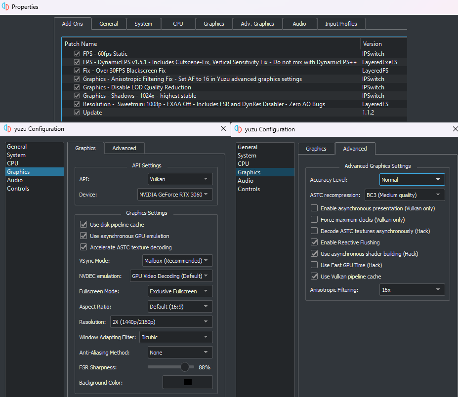

# Mods collection for Zelda: Tears of the Kingdom

#  [SURVEY of your Emulation performance and Recommended configuration, Please reply.](https://github.com/HolographicWings/TOTK-Mods-collection/issues/72)👍

## :exclamation:**WARNING : Read the "Compatible version.txt" in every mod to know which game version it is compatible with.**

## 

## Recommended setup :
- **Mods:**
  - Resolution - SweetMini 1008p - FXAA Off
  - FPS - 60fps Static
  - FPS - DynamicFPS v1.5.1
  - Graphics - Anisotropic Filtering Fix - Set AF to x16 in Yuzu advanced graphics settings
  - Graphics - Disable LOD Quality Reduction
  - Graphics - Shadows - 1024x
  - Fix - Over 30FPS Blackscreen Fix
   **BEWARE!** Don't use the Blackscreen Fix if you use any controller UI mod (Playstation/Xbox). In this case use only the version "fix" of the controller mod.

- **Yuzu Graphics:**
  - Render API: Vulkan
  - Use Disk Pipeline Cache: On
  - Use asynchronous GPU emulation: On
  - Accelerate ASTC Texture Decoding: On
  - Vsync Mode: Mailbox
  - NVDEC emulation: GPU Video Decoding
  - Fullscreen Mode: Exclusive Fullscreen or Borderless Windowed and press F11
  - Aspect Ratio: Default (16:9)
  - Resolution: 2x or higher.
  - Window Adapting Filter: Bicubic
  - Anti-Aliasing Method: No AA
  - FSR Sharpness: Don't change

- **Yuzu Advanced Graphics:**
  - Accuracy Level: Normal
  - ASTC recompression: Depends on your GPU vRAM: BC1 for 2GB, BC3 for 4-8GB, Uncompressed for more
  - Enable asynchronous presentation (Vulkan only): Off
  - Force maximum clocks (Vulkan only): Off
  - Decode ASTC textures asynchronously: Off
  - Enable Reactive Flushing: On
  - Use asynchronous shader building: On (Turn Off if you have weird weapons icons)
  - Use Fast GPU Time: Off
  - Use Vulkan Pipeline Cache: On
  - Anisotropic Filtering: x16 - Install the mod "Anisotropic Filtering Fix" to work. Switch back to Default if you have bugs on AMD cards.

- After setup your configurations should look like this:

- **Ryujinx settings:**
  - Need more documentation  
  
**

CLICK TO VIEW WHY WE USE THESE SETTINGS
**
  
  - Mods :  
    - Resolution - SweetMini 1008p - FXAA Off (or On, this is personal preference) - Includes FSR and DynRes Disabler - Zero AO Bugs
    - FPS - 60fps Static  
    - FPS - DynamicFPS v1.5.1 - Includes Cutscene Fix, Ultrahand Fix- Do not mix with DynamicFPS++
    - Fix - Over 30FPS Blackscreen Fix (unless you are using a controller UI mod, which already has this)
    - Graphics - Anisotropic Filtering Fix - Set AF to 16 in Yuzu advanced graphics settings
    - Graphics - Disable LOD Quality Reduction
    - Graphics - LOD Improvement
    - Graphics - Shadows - 1024x - highest stable  
  
- Yuzu Graphics :  
  - Render API : Vulkan  
  - Use Disk Pipeline Cache: On  
  - Use asynchronous GPU emulation : On  
  - Accelerate ASTC Texture Decoding : On  
  - Vsync Mode: Mailbox (Or off if you don't mind frame tearing or use any alternate method for avoid it)  
  - NVDEC emulation : GPU Video Decoding (This is for cutscenes, try CPU Video Decoding if you have a weak gpu)  
  - Fullscreen Mode : Exclusive Fullscreen or Borderless Windowed and press F11  
  - Aspect Ratio : Default (16:9) (Use Strech to Window if using an aspect ratio mod)
  - Resolution : 2x or higher depending on your PC specs. This will multiply the render resolution, in vanilla ToTK it's 1600x900.
  - Window Adapting Filter : 
    - Bicubic if the render resolution is above your monitor resolution  
    - Bilinear if the render resolution is equal to your monitor resolution  
    - FSR if the render resolution is under your monitor resolution  
  - Anti-Aliasing Method : No AA or SMAA (FXAA break colors in darkness)  
  - FSR Sharpness : Set to taste, this setting only functions when Window Adapting Filter is set to FSR.  

- Yuzu Advanced Graphics :  
  - Accuracy Level : Normal (High has worse GPU performance, but with a lower risk of visual bugs, TotK does not currently need High except for debugging.)
  - ASTC recompression : Uncompressed (BC3 and BC1 lower the VRAM usage so it depend of your GPU VRAM amount, (BC3 for 4GB-8GB, BC1 for 2GB))  
  - Enable asynchronous presentation (Vulkan only): Off (framepacing is negatively impacted if you enable, only use if you are 1-2 fps from your locked fps target)  
  - Force maximum clocks (Vulkan only) : Off (possible small benefit if using very slow or fast hardware, but will waste power efficency)  
  - Decode ASTC textures asynchronously : Off ("On" may reduce texture loading stutters, but causes black squares and glitched loading screens)  
  - Enable Reactive Flushing : On (Improves syncing of memory)  
  - Use asynchronous shader building : On (Greatly reduces stuttering when shaders are compiling)  
  - Use Fast GPU Time : Off ("Off" has Higher Accuracy with "Dynamic FPS" and "DynamicFPS++" but for some reason "On" fixed a rare issue where FPS was extremely low and GPU usage extremely High, if you get that issue, try On and report the result to us please)  
  - Use Vulkan Pipeline Cache : On (Immense reduction in initial game loading time for AMD, improves shader compilation stutter for NVIDIA and Intel as well)  
  - Anisotropic Filtering : x8 or x16 (Will only work if you use the "Anisotropic Filtering Fix" mod, if you experience graphical bugs with an AMD card, switch back to Default)  

- Ryujinx settings :  
  - Really need more documentation  
  
  

## Mod description & usage:

- FPS - **20fps/30fps/60fps Static:** Changes the game's framerate lock. Use with DynamicFPS.
 The game will be in slow motion if you are under the framerate indicated and speed up if you are over, including cutscenes. Combine with a dynamic fps mod to fix this behavior.
 *Why use the 30fps mod?* : The game locks to 20 fps if your framerate is anything lower than 30, the mod corrects this.

- FPS - **Dynamic FPS:** Matches the game clock to your framerate and fixes slow motion/speed up. Recommended to use with FPS mods above.
 Alternativelly you can uncheck the Yuzu's "Limit Speed Percent" in General settings (Ctrl + U) as well as setting "VSync Mode" to OFF without 'speed up' your game.
 **BEWARE!** When you use Dynamic FPS mod under 15 FPS, the physics will break!.
 **BEWARE!** Incompatible with DynamicFPS++.

- FPS - **DynamicFPS++:** An alternative version of the Dynamic FPS mod by "somerandompeople", do not use 20, 30 or 60 FPS mods (its included already).
 This mod may have less stuttering depending on your hardware. We recommend to test by yourself and compare with the combo Dynamic FPS and FPS 30/60 mods.
 **BEWARE!** Incompatible with Dynamic FPS.

- FPS - **Fix Over 30FPS Blackscreen Fix:** Fixes black background on weapon switch UI when playing above 30fps.
 :exclamation:Overwrites "Common.Product.110.Nin_NX_NVN.blarc", don't install two mods overwriting the same file.
 This mod overwrite the Xbox UI and Playstation UI mods. Use the version "fix" of these mods instead (they include the Blackscreen-fix).

- Graphics - **Disable Internal FSR Downscaling:** This mod disables the game's internal FSR. Do not mistake with Yuzu's own FSR on the "Window Adapting Filter" in Graphics settings.
 FSR is an optimisation method that upscales the game resolution using several algorithms (similar to DLSS but without advanced AI or temporal information). It can increase GPU performance at the cost of some details and potential graphical artifacts.
 Disable FSR if you are using better methods like Yuzu's FSR or even better: using real improved resolution.

- Graphics - **Disable Internal FXAA v2:** Disables TotK's internal FXAA.
 FXAA smoothes edges to avoid aliasing (jagged edges) and costs very little GPU performance.
 If you want a better anti aliasing, we recommend using SMAA on the "Anti-Aliasing Method" in Graphics settings (at a slightly cost on GPU performance). Using a resolution above your monitor can also work as anti-alising, but have high cost on your GPU (see the **Resolution** section).
 :exclamation:Overwrites "Bootup.Nin_NX_NVN.pack.zs", don't install two mods overwriting the same file!

- Graphics - **Disable Dynamic resolution when low FPS:** Prevents the resolution being reduced when your framerate is under 30fps.

- Graphics - **LOD Improvement:** Increases the Level of Detail on certain models.
 LOD (Level Of Detail) shows higher quality models when you are close to them, and lower quality models when they are further away.
 Potentially has a minor performance impact.
 Compatible with "Disable LOD Quality Reduction" mod.
 [Comparison On/Off](https://imgsli.com/MTgyMzE5)

- Graphics - **Disable LOD Quality Reduction:** when low FPS : Prevents the LOD decreasing when your framerate is under 30fps.
 LOD (Level Of Detail) shows higher quality models when you are close to them, and lower quality models when they are further away.
 By default, when your framerate is low, the game lowers the LOD to increase GPU performance, causing textures and models to visibly get worse.
 Compatible with "LOD Improvement" mod.

- Graphics - **Island Fix:** Fix the Outline edges around the Sky Islands bugged over 2x resolution scaling.
 Only required if your Resolution scale in Graphics settings" is over 1x. May cause edge artifacts.
 [Comparison On/Off](https://i.imgur.com/M01IPBw.png)

- Graphics - **Disable Targeting DOF:** Disables the Depth-of-Field blurring effect when targeting enemies or NPCs.
 DOF (Depth-of-Field) is an effect that blurs the background when an object is focused by the camera. Install if you don't like the effect.

- Graphics - **Shadows:** Changes the resolution of shadows.
 256 and 512 could possibly increase your game performance if you are GPU bounded, but sacrifices shadow quality.
 Original game has shadow quality at 960 or below.
 1024 will improve shadow quality, and it can fix some graphical issues on certain setups.
 [Shadow stuttering issue took by Lux using a Radeon RX 580 8Gb - with & without Shadows x512](https://imgsli.com/MTc5MTM1)
 [Gloom issue took by Red_BY using a RTX 2080 at 3x render scale - with & without Shadows x1024](https://imgsli.com/MTc5MTYx)

- Graphics - **Anisotropic Filtering fix:** Fixes Anisotropic Filtering.
 Anisotropic Filtering increase the texture quality when textures are viewed at oblique angles, like the floor at distance.
 Set Anisotropic Filtering to 16 in Yuzu advanced graphics settings.
 [Difference Off/On](https://imgsli.com/MTc5MzQ0)

- **Resolution:** Changes internal rendering resolution. Original is 1600x900 in Docked mode and 1280x720 in Handheld mode.
 :exclamation:Don't confuse 1080p and 1008p, they aren't the same number!
  
  - 1080p (1920x1080) when scaled above 1x resolution will break *Ambient Occlusion (AO)* (unless you use a custom Yuzu build created by ChucksFeedandSeed). Use if you are using Resolution at 1x.
   *Ambient occlusion* is a rendering technique that simulates the exposure of ambient light on an object.
   [AO vs no AO](https://imgsli.com/MTc5MTI4/2/3)
  
  - Chuck's 1008p (1792x1008) will not break AO above x1 resolution.
  
  - SweetMini's 1008p (1792x1008) will not break AO above x1 resolution. It also automatically disables FSR, disables dynamic resolution, and exists in two versions for FXAA on or off.
   :exclamation:"SweetMini 1008p" overwrites "Bootup.Nin_NX_NVN.pack.zs", don't install two mods overwriting the same file.
  
  - 1026p (1824x1026) will not break AO above x1 resolution. It also automatically disables FSR, disables dynamic resolution, and exists in two versions for FXAA On or Off. Can cause artifacts in shadows, we don't recommend this option anymore.
   :exclamation:"1026p" overwrites "Bootup.Nin_NX_NVN.pack.zs", don't install two mods overwriting the same file.
  
  - 1080p OldManKain - Disable FSR-FXAA : From OldManKain based and theboy181.
    - Breaks AO above 1x scale on Yuzu.
    - As written in the name, this mod disables FSR and FXAA too.
    - Uses code editing instead of game file editing.
  
  - 540p and 720p require to change the "Resolution" scaling in Yuzu Graphics Settings to reach your monitor resolution or better. Use the table bellow:  
    - 540p and x2 = 1080p.
    - 540p and x4 = 4K.
    - 540p and x8 = 8K.
    - 720p and x2 = 1440p.
    - 720p and x3 = 4K.
    - 720p and x6 = 8K.
    
    :exclamation:Some elements like the UI and Ambient Occlusion may not scale and can look worse than other resolution mods. 

You can use resolution mods with x1 Resolution scale or lower to increase GPU performance.
To experience the best quality, we advise you to use an internal rendering resolution of double your monitor's resolution.

- **Ratio:** Experimental - change the aspect ratio from 16:9.
  - You should change "Aspect Ratio" in Graphics Yuzu settings to "Stretch to Window".
  - Fixes the 3D scene render, but will cause the HUD to stretch.

- **Combos:** They are all-in-one mods, don't combine them with unspecified mods, if you don't know what you are doing.
  - **30/60fps + Dynamic FPS** are a simple Combo of these two mods, into one.
  - **Light pack and Unlimited FPS** : Pack made by HolographicWings, combine Dynamic FPS, 1008p and Disable FSR, it's a minimal pack for a clean experience.
You can use it with any Graphics other pack, ratio and cheats but it's not recommended.
In order to play above 30 FPS, press Ctrl + U in game to unlock your framerate, like that you can play at 60, or more, with normal game speed.
Don't forget to press Ctrl + U again, to lock back your framerate to 30fps, when you get a cutscene.
  - Lazy Pack are made by Hover and merge several useful mods.
 :exclamation:The versions without "UI Mod compatible" in their name Overwrites "Common.Product.110.Nin_NX_NVN.blarc.zs", don't install two mods overwriting the same file.

### "Lazy Packs"

**A patch containing over a dozen fixes and mods, with the intent of "just making it work like its supposed to".** 
"Lazy packs" are customized according to resolution, framerate, and UI mod compatibility.
UI compatibility means that the patch is compatible with mods such as the Xbox UI mod below.
Otherwise, blackscreenfix is enabled in the non-compatible versions, for use with normal Nintendo UI.
Using an non-compatible version, along with a UI mod, will result in the UI mod largely not functioning, or not at all.
Please see below for details on how to use, and below that, the exact contents of the patch, and credits to the developers of them.

 Click to view how to use the lazy pack

[Follow this guide to configure Yuzu correctly for Tears of the Kingdom.](https://github.com/HolographicWings/TOTK-Mods-collection/tree/main/Guide)

- Install Tears of the Kingdom Patch 1.1.0. or 1.1.1.
- Decide on a framerate. 30 or 60?
- Decide on a resolution. 720p, 1080, 1440p, 4K or 8K?
- Decide if you want to use the Nintendo controller UI, or a UI mod, such as the Xbox and Playstation mods linked above.

Take this pack as an example:
1.1.0 - Lazy Pack - **60 FPS** - **720P 1X** - **1440P 2X** - **4K 3X** - **8K 6X** - scaling - **UI Mod compatible**

- This patch features 60 FPS.
- It scales between 720p, 1440p, 4K and 8K, depending on what resolution scaling you choose in Yuzu's graphics settings, as shown in picture 7 in the guide below, for reference.
- And it features compatibility with UI controller mods, such as the Xbox or Playstation mods linked above.

If you were to decide to target **30 FPS**, **1080p**, and you would like the **Steam Deck UI**, you should choose:
1.1.0 - Lazy Pack - **30 FPS** - **1080P 1X scaling** - **UI Mod compatible**

And, if you were to decide to play on a beefy **1080p** PC at **60 FPS**, using your Switch Pro controller, and you would like the **Normal, Nintendo controller UI**, you should choose:
1.1.0 - Lazy Pack - **60 FPS** - **1080P 1X scaling**

The non-compatible versions contain Blackscreen-fix, which is incompatible with UI mods.

Click to view the patches included in the lazy pack 

// Credit: @Wollnashorn
// Force bilinear terrain samplers to be trilinear
// Set mipmap filter to nearest on shadow map sampler

// Credit: @Marethyu
// Blackscreen-fix

// Credit: @ChucksFeedAndSeed
// Disable Dynamic Resolution
// Disable FSR sharpening filter
// Shadow Resolution set to 1024
// FXAA disabled
// LOD fix

// Credit: @Patchanon
// Disable FSR up/downscaling
// 1080p v1.1.0
// Disable LOD reduction when framerate dips v1.1.0

// Credit: @somerandompeople
// SOURCED FROM [HERE](https://gbatemp.net/download/loz-tears-of-the-kingdom-20fps-30fps-60fps-patch.37996/)
// 30/60 DynamicFPS++
// Disable LOD reduction when framerate dips v1.1.1

// Credit: @ChanseyIsTheBest
// Docked 720p

// Credit: @OldManKain
// 1080p, Disabled FXAA and FSR scaler v1.1.1

 

- Cheats :
  - 10x Durability overwrites all Weapons, Bows, Shields, don't install two mods overwriting the same file.
  - The Movement Speed cheats breaks the game time (time will be wrong when saving)
  - Stamina cheat doesn't seem to work.
  - Infinite amiibo usage is pointless since yuzu has a similar feature, go in Yuzu settings → Controls → Advanced and check "Use random Amiibo ID".
  - Beware, all cheats can cause unwanted side effects.

 
 The main TOTK performance issue comes from the CPU and not the GPU, but unfortunately we don't have an easy way of increasing CPU performance.
 
 
 Other good mods :

- [Xbox / Steam Deck UI + Blackscreenfix](https://gamebanana.com/mods/443354) by Alerion921

- [Playstation UI + Blackscreenfix](https://gamebanana.com/mods/443201) by Alerion921

- [Amiibo Anti-RNG](https://gamebanana.com/mods/443894) by JordanBTucker

- [Updated 1.1.1 and 1.1.2 Cheat Codes](https://github.com/bad1dea/NXCheats/tree/main/The%20Legend%20of%20Zelda%20Tears%20of%20the%20Kingdom) by bad1dea

 Useful links :

- [Save Editor](https://www.marcrobledo.com/savegame-editors/zelda-totk/) by Marc Robledo
 

> Thanks to [ChucksFeedAndSeed](https://www.reddit.com/user/ChucksFeedAndSeed/) for many of the mods in this collection.

 Copyright and source of mods :

- [20/30 and 60 fps v3](https://gbatemp.net/download/loz-tears-of-the-kingdom-20fps-30fps-60fps-patch.37996/) : Authors are "ChucksFeedAndSeed, patchanon and somerandompeople"

- [DynamicFPS](https://gbatemp.net/download/loz-tears-of-the-kingdom-fps-static-fps-and-visual-fixes-patch-collection.37996/) : ChucksFeedAndSeed

- [DynamicFPS++](https://gbatemp.net/download/loz-tears-of-the-kingdom-fps-static-fps-and-visual-fixes-patch-collection.37996/) : somerandompeople

- SweetMini 1008p Resolution : SweetMini, contribution by Socats and Darktalon

- 1080p Resolution : ChucksFeedAndSeed

- [Combo - VisualFixes](https://gbatemp.net/download/loz-tears-of-the-kingdom-20fps-30fps-60fps-patch.37996/) : Authors are "ChucksFeedAndSeed, patchanon and somerandompeople"

- Graphic patches : Authors are "ChucksFeedAndSeed, patchanon and somerandompeople", theses patches are split from the VisualFixes, FSR Disabler is especially from patchanon

- [Aspect Ratio](https://gamebanana.com/mods/443462) : From Fayaz

- [Graphics - Anisotropic filtering fix](https://github.com/Wollnashorn/switch-mods/tree/master/0100F2C0115B6000) : @Wollnashorn

- FPS - Cutscene-fix : theboy181

- Graphic - Disable Targeting DOF : theboy181

- Fix - Over 30FPS Blackscreen Fix : by MarethyuX

- Cheat - Durability (10x) : SweetMini

- Cheat - Time of day : FrostedMint
Unknown compatibily with FPS, Dynamic FPS and DynamicFPS++ mods, testing is required, open an issue to report the result if you tried.

- Graphics - Disable Internal FXAA v2 : SweetMini

- Graphics - Island Fix : SweetMini

- Graphics - LOD Improvement : SweetMini

- Graphics - Vertical Sensitivity Fix: igoticecream

- Resolution - 1026p : Zeikken
