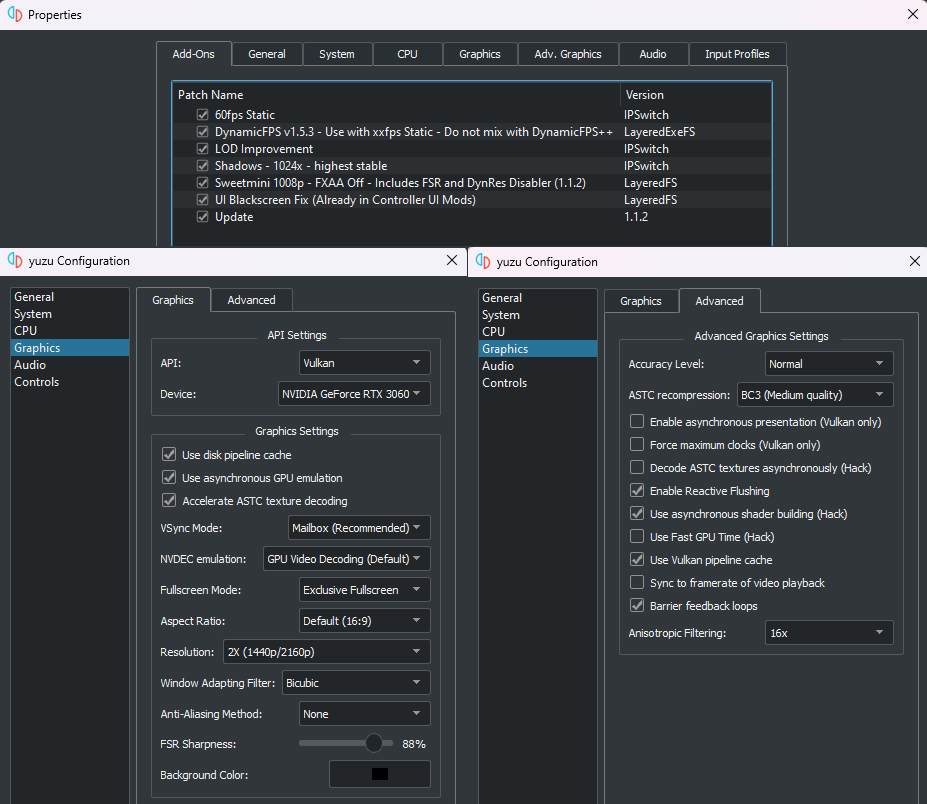

# Contents  
### [Quick Setup](#quick-setup-1)  
### [Detailed Setup](#detailed-setup-1)

# Quick Setup
**[Mods Download](https://github.com/HolographicWings/TOTK-Mods-collection/releases)**
- **Recommended Game Version:** 1.1.2
- **Recommended Mods:**
  - Resolution - SweetMini 1008p - FXAA Off (1.1.2)
  - FPS - 60fps Static (Use 30fps Static if you can't reach 60)
  - FPS - DynamicFPS v1.5.3
  - Graphics - LOD Improvement
  - Graphics - Shadows - 1024x
  - FPS - UI Blackscreen Fix
   **BEWARE!** Don't use the Blackscreen Fix if you use any controller UI mod (Playstation/Xbox). In this case use only the version "fix" of the controller mod.

- **Recommended Yuzu Graphics:**
  - API: Vulkan
  - Use Disk Pipeline Cache: On
  - Use asynchronous GPU emulation: On
  - Accelerate ASTC Texture Decoding: On
  - VSync Mode: Mailbox
  - NVDEC emulation: GPU Video Decoding
  - Fullscreen Mode: Exclusive Fullscreen
  - Aspect Ratio: Default (16:9)
  - Resolution: 2x or higher.
  - Window Adapting Filter: Bicubic
  - Anti-Aliasing Method: None
  - FSR Sharpness: Don't change

- **Recommended Yuzu Advanced Graphics:**
  - Accuracy Level: Normal
  - ASTC recompression depends on your GPU vRAM:
    - BC1 for 2GB,
    - BC3 for 4-6GB,
    - Uncompressed for more.
  - Enable asynchronous presentation (Vulkan only): Off
  - Force maximum clocks (Vulkan only): Off
  - Decode ASTC textures asynchronously (Hack): Off
  - Enable Reactive Flushing: On
  - Use asynchronous shader building (Hack): On
     Turn Off if you have weird weapons icons and then right click the game name -> Remove -> Remove Cache Storage.
  - Use Fast GPU Time (Hack): Off (turn off only for TOTK in Right Click the game name -> Properties)
  - Use Vulkan Pipeline Cache: On
  - Sync to framerate of video playback: Off
  - Barrier feedback loops: On
  - Anisotropic Filtering: 16x

- After setup your configurations should look like this example (your settings may vary, read above):

- **Ryujinx settings:**
  - Need more documentation

# Detailed Setup
**[Mods Download](https://github.com/HolographicWings/TOTK-Mods-collection/releases)**
- **Recommended Game Version:** 1.1.2
- **Recommended Mods:**
    - Resolution - SweetMini 1008p - FXAA Off (or On, this is personal preference) - Includes FSR and DynRes Disabler - Zero AO Bugs
    - FPS - 60fps Static (use 30fps Static if you can't reach 60fps)
    - FPS - DynamicFPS - Includes Cutscene Fix, Ultrahand Fix - **Do not mix with DynamicFPS++**
    - FPS - UI Blackscreen Fix (unless you are using a controller UI mod, which already has this)
    - Graphics - LOD Improvement - Version 2.0 improve LOD while also having a minor performance improvement. More info on the [README](README.md)
    - Graphics - Shadows - 1024x - highest stable (Fix weird shadow flickering and broken Gloom)

- **Recommended Yuzu Graphics:**
  - Render API: Vulkan (OpenGL can have weird visual glitches)
  - Use Disk Pipeline Cache: On (Clear the pipeline caches when they grow up too much)
  - Use asynchronous GPU emulation: On
  - Accelerate ASTC Texture Decoding: On
  - VSync Mode: Mailbox (Or FIFO if you don't have this option)
  - NVDEC emulation: GPU Video Decoding (This is for cutscenes, try CPU Video Decoding if you have a weak gpu)
  - Fullscreen Mode: Exclusive Fullscreen (Borderless Fullscreen breaks GSYNC)
  - Aspect Ratio: Default (16:9) (Use Stretch to Window if using an aspect ratio mod)
  - Resolution: 2x or higher depending on your PC specs. This will multiply the render resolution, in vanilla ToTK it's 1600x900.
  - Window Adapting Filter:
    - Bicubic if the render resolution is above your monitor resolution
    - Bilinear if the render resolution is equal to your monitor resolution
    - FSR if the render resolution is under your monitor resolution
  - Anti-Aliasing Method: None if you are using scaling above your monitor resolution. Choose at will otherwise.
  - FSR Sharpness: Set to taste, this setting only functions when Window Adapting Filter is set to FSR.

- **Recommended Yuzu Advanced Graphics:**
  - Accuracy Level: Normal (High has worse GPU performance, but with a lower risk of visual bugs, TotK does not currently need High except for debugging)
  - ASTC recompression depends on your GPU vRAM:
    - BC1 for 2GB,
    - BC3 for 4-6GB,
    - Uncompressed for more.
  - Enable asynchronous presentation (Vulkan only): Off (framepacing is negatively impacted if you enable, only use if you are 1-2 fps from your locked fps target)
  - Force maximum clocks (Vulkan only): Off (possible small benefit if using very slow or fast hardware, but will waste power efficiency)
  - Decode ASTC textures asynchronously (Hack): Off ("On" may reduce texture loading stutters, but causes black squares and glitched loading screens)
  - Enable Reactive Flushing: On (Improves syncing of memory)
  - Use asynchronous shader building (Hack): On (Reduces stuttering when shaders are compiling. Turn Off if you have weird weapons icons and right click the game name -> Remove -> Remove Cache Storage.)
  - Use Fast GPU Time (Hack): Off ("Off" has Higher Accuracy with "Dynamic FPS" and "DynamicFPS++" but for some reason "On" fixed a rare issue where FPS was extremely low and GPU usage extremely High, if you get that issue, try On and report the result to us please). Use "Off" only for TOTK (Right click -> Properties)
  - Use Vulkan Pipeline Cache: On (Immense reduction in initial game loading time for AMD, improves shader compilation stutter for NVIDIA and Intel as well)
  - Sync to framerate of video playback: Off (It's included on DynamicFPS)
  - Barrier feedback loops: On (Solves transparency issues with Ultrahand)
  - Anisotropic Filtering: 8x or 16x

- **Ryujinx settings:**
  - Really need more documentation
