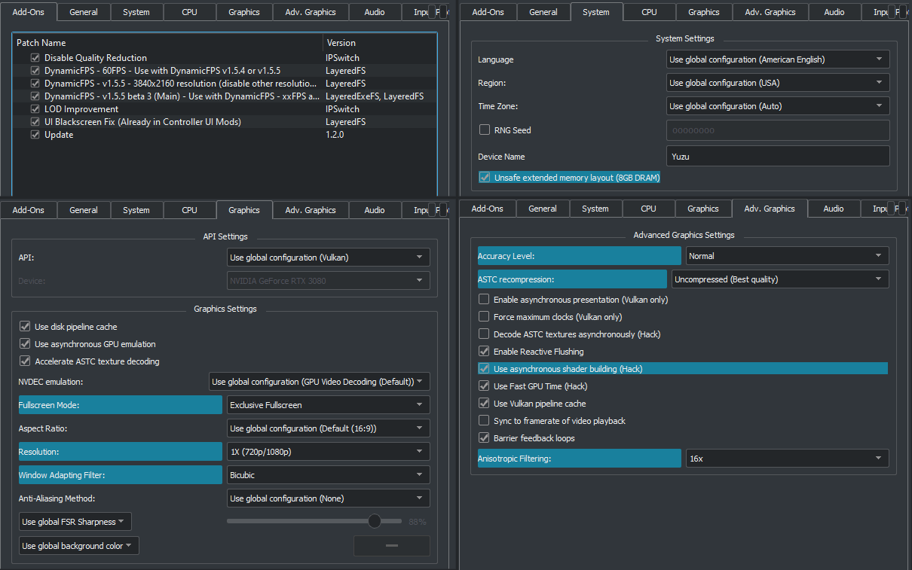

# Contents
### [Quick Setup](#quick-setup-1)
### [Resetting Yuzu Settings](#resetting-yuzu-settings-1)
### [Detailed Setup](#detailed-setup-1)
### [Mods Download](https://github.com/HolographicWings/TOTK-Mods-collection/releases)

# Quick Setup
- **Recommended Game Version:** 1.2.0
## Recommended Mods:
**[Mods Download](https://github.com/HolographicWings/TOTK-Mods-collection/releases)**
  - FPS - DynamicFPS - 30FPS
     Use 60fps if you have a hexa-core from 2021 or better.
  - FPS - DynamicFPS - v1.5.5 - 1920x1080 resolution
     Use 3840x2160 resolution if you have an GTX 1070 (8GB) equivalent or better.
  - FPS - DynamicFPS v1.5.5 beta 3 (main)
  - FPS - UI Blackscreen Fix.
     :exclamation:Don't use the Blackscreen Fix if you use any controller UI mod (Playstation/Xbox).
  - Graphics - Disable Quality Reduction
  - Graphics - LOD Improvement

## Recommended Yuzu System setting:
**Right Click on the game name -> Properties -> System:**
  - Unsafe extended memory layout (8GB DRAM): On
     If you have less than 16GB RAM, turn off and use the mod "Shadows 1024x". More about in [Detailed Setup](#detailed-setup-1)

## Recommended Yuzu Graphics:
**Emulation -> Configure -> Graphics**
  - VSync Mode: Mailbox if available. Otherwise FIFO.

Everything else at [the default](#resetting-yuzu-settings-1).

**Right Click on the game name -> Properties -> Graphics:**
  - API: Vulkan
  - Use Disk Pipeline Cache: On
  - Use asynchronous GPU emulation: On
  - Accelerate ASTC Texture Decoding: On
  - NVDEC emulation: GPU Video Decoding
  - Fullscreen Mode: Exclusive Fullscreen
  - Aspect Ratio: Default (16:9)
  - **Resolution: 1x Always**
  - Window Adapting Filter: Bicubic
  - Anti-Aliasing Method: None
  - FSR Sharpness: Don't change

## Recommended Yuzu Advanced Graphics:
**Right Click on the game name -> Properties -> ADV. Graphics:**
  - Accuracy Level: Normal
  - ASTC recompression depends on your GPU vRAM:
    - BC1 for 2GB,
    - BC3 for 4-6GB,
    - Uncompressed for more.
  - Enable asynchronous presentation (Vulkan only): Off
  - Force maximum clocks (Vulkan only): Off
  - Decode ASTC textures asynchronously (Hack): Off
  - Enable Reactive Flushing: On
  - Use asynchronous shader building (Hack): Off
  - Use Fast GPU Time (Hack): On
  - Use Vulkan Pipeline Cache: On
  - Sync to framerate of video playback: Off
  - Barrier feedback loops: On
  - Anisotropic Filtering: 16x

After setup your configurations should look like this example for a High-End PC. Your settings may vary, read above:

# Resetting Yuzu Settings
**IMPORTANT: Before reset the settings, make a backup of your save folder:**
- Right Click on the game name -> Open Save Data Location -> Copy everything to a safe location

**Steps to safely reset Yuzu settings do defaults:**
- Right Click on the game -> Open Mod Data Location -> Delete all mods.
- Reset Yuzu settings in Configure -> "Reset All Settings" button.
- Clear the cache by right click on the game name -> Remove -> "Remove All Pipeline Caches".
- Clear the cache storage by right click on the game name -> Remove -> "Remove Cache Storage".
- Restart your PC. (This is important!)
- Install the newest yuzu version.
- Start the game and wait a couple minutes to rebuild the shaders.

# Detailed Setup
- **Recommended Game Version:** 1.2.0
## Recommended Mods:
**[Mods Download](https://github.com/HolographicWings/TOTK-Mods-collection/releases)**
  - FPS - DynamicFPS - 30FPS
     Use 60fps if you have a hexa-core from 2021 or better, like the Desktop version of Intel i5 or AMD Ryzen 5. Laptop performs worse!
  - FPS - DynamicFPS - v1.5.5 - 1920x1080 resolution
     Use 3840x2160 resolution if you have an GTX 1070 (8GB) or better. Is recommended to use resolutions multiples of 1920x1080, even if your monitor is 1440p.
  - FPS - DynamicFPS v1.5.5 beta 3 (main) - Even in the beta stage, this mod is so impressive that became recommended.
  - FPS - UI Blackscreen Fix (unless you are using a controller UI mod, which already has this)
  - Graphics - LOD Improvement - Version 2.0 improve LOD while also having a minor performance improvement. More info on the [README](README.md)
  - Graphics - Disable Quality Reduction - Mandatory if you are using DynamicFPS.

## Recommended Yuzu System
**Right Click on the game name -> Properties -> System:**
  - Unsafe extended memory layout (8GB DRAM): On
     This setting increases the amount of emulated RAM from the Switch's original 4GB to 8GB.
	 It's used by DynamicFPS to increase resolution and activate its own shadow mod. The shadow part is needed to fix the Shadow Flicker Bug, if you disable "extended memory" you will need to use the mod "Shadows 1024x" to fix the bug.
	 It was tested on and old Intel i7 4770 with 16GB RAM. It works better than expected even at the limit of RAM. Dont' open anything besides Yuzu (specially Chrome)!
	 Turn off if you have less than 16GB RAM.

## Recommended Yuzu Graphics:
**Emulation -> Configure -> Graphics**
  - VSync Mode: Mailbox if available. Otherwise FIFO.

Everything else at [the default](#resetting-yuzu-settings-1).

**Right Click on the game name -> Properties -> Graphics:**
  - Render API: Vulkan (OpenGL can have weird visual glitches)
  - Use Disk Pipeline Cache: On (Clear the pipeline caches when they grow up too much)
  - Use asynchronous GPU emulation: On
  - Accelerate ASTC Texture Decoding: On
  - NVDEC emulation: GPU Video Decoding (This is for cutscenes, try CPU Video Decoding if you have a weak gpu)
  - Fullscreen Mode: Exclusive Fullscreen (Borderless Fullscreen breaks GSYNC)
  - Aspect Ratio: Default (16:9) (Use Stretch to Window if using an aspect ratio mod)
  - Resolution: 1x. **Don't change this**, mods do a better job at scaling resolution.
  - Window Adapting Filter:
    - Bicubic if the render resolution is above your monitor resolution
    - Bilinear if the render resolution is equal to your monitor resolution
    - FSR if the render resolution is under your monitor resolution
  - Anti-Aliasing Method: None if you are using scaling above your monitor resolution. Choose at will otherwise.
  - FSR Sharpness: Set to taste, this setting only functions when Window Adapting Filter is set to FSR.

## Recommended Yuzu Advanced Graphics:
  - Accuracy Level: Normal (High has worse GPU performance, but with a lower risk of visual bugs, TotK does not currently need High except for debugging)
  - ASTC recompression depends on your GPU vRAM:
    - BC1 for 2GB,
    - BC3 for 4-6GB,
    - Uncompressed for more.
  - Enable asynchronous presentation (Vulkan only): Off (framepacing is negatively impacted if you enable, only use if you are 1-2 fps from your locked fps target)
  - Force maximum clocks (Vulkan only): Off (possible small benefit if using very slow or fast hardware, but will waste power efficiency)
  - Decode ASTC textures asynchronously (Hack): Off ("On" may reduce texture loading stutters, but causes black squares and glitched loading screens)
  - Enable Reactive Flushing: On (Improves syncing of memory)
  - Use asynchronous shader building (Hack): Off (Reduces stuttering when shaders are compiling but causes weird weapons icons. To fix it turn the option off and right click the game name -> Remove -> Remove Cache Storage)
  - Use Fast GPU Time (Hack): On (DynamicFPS 1.5.5 changed a lot, please report if you are having issues with this settings)
  - Use Vulkan Pipeline Cache: On (Immense reduction in initial game loading time for AMD, improves shader compilation stutter for NVIDIA and Intel as well)
  - Sync to framerate of video playback: Off (It's included on DynamicFPS)
  - Barrier feedback loops: On (Solves transparency issues with Ultrahand)
  - Anisotropic Filtering: 8x or 16x
